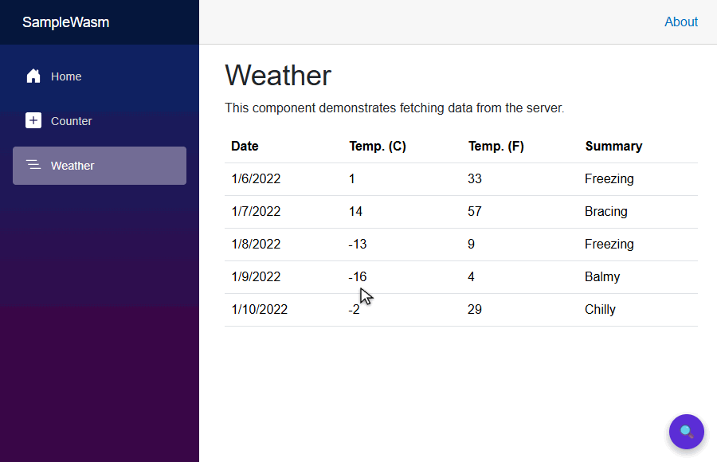

# BlazorInspector

[](https://github.com/kobrien603/BlazorInspector/actions/workflows/ci.yml)
[](https://www.nuget.org/packages/BlazorInspector)
[](LICENSE)
[](#requirements)
[](#requirements)

A Vue/React-DevTools-style **in-app component inspector** for **Blazor WebAssembly** and **MAUI Blazor
Hybrid**. It's a focused, local debugging tool that's complementary to the more mature
[BlazorDeveloperTools](#how-it-compares-to-blazordevelopertools) — the two cover different render
modes (see the comparison below to pick the right one).

Open a floating panel inside your running app to browse the live component tree, inspect (and edit)
each component's parameters and state, hover the page to highlight elements, and jump straight to a
component's `.razor` source in VS Code.



> [!IMPORTANT]
> **Debug-only by design.** The inspector reflects over private ASP.NET Core internals — fine for a
> local debugging tool, but can be broken by IL trimming / WASM AOT. Everything is gated behind
> `#if DEBUG` and is a **no-op in Release builds**. Don't ship it enabled.

## Table of contents

- [How it compares to BlazorDeveloperTools](#how-it-compares-to-blazordevelopertools)
- [Features](#features)
- [Requirements](#requirements)
- [Installation](#installation)
- [Quick start](#quick-start)
- [Configuration](#configuration)
- [Jump-to-code setup](#jump-to-code-setup)
- [How it works](#how-it-works)
- [Limitations & known issues](#limitations--known-issues)
- [Building from source](#building-from-source)
- [Contributing](#contributing)
- [License](#license)

## How it compares to BlazorDeveloperTools

BlazorInspector is **complementary to — not a replacement for —**
[**BlazorDeveloperTools**](https://github.com/joe-gregory/blazor-devtools) by
[@joe-gregory](https://github.com/joe-gregory), the excellent and more mature DevTools project for
Blazor ([NuGet](https://www.nuget.org/packages/BlazorDeveloperTools) ·
[blazordevelopertools.com](https://blazordevelopertools.com) ·
[Chrome Web Store](https://chromewebstore.google.com/detail/blazor-developer-tools/pfddbenemjnlceffaemllejnjbobadhp)).
The two tools cover **different render modes**, so which one you want depends on how your app runs:

| | [BlazorDeveloperTools](https://github.com/joe-gregory/blazor-devtools) | BlazorInspector (this project) |
|---|---|---|
| **Render modes** | Server, InteractiveServer, InteractiveAuto | WebAssembly, MAUI Blazor Hybrid |
| **Form factor** | Chrome/Edge DevTools extension + NuGet package | In-app overlay (Razor Class Library) |
| **Highlights** | Component tree, timeline/flamegraph profiler, "why did this render?", element picker | Component tree, parameter/state inspection, expandable + inline-editable values, hover highlight, jump-to-code |
| **Maturity** | Mature, actively maintained, richer feature set | Focused personal/local debugging tool |

**Which should you use?**

- Running Blazor **Server** or **InteractiveAuto**? Use **BlazorDeveloperTools** — that's exactly what
  it's built for, and a browser DevTools extension is the right form factor there. (It also can't load
  into a MAUI `BlazorWebView`, which is the other half of the story.)
- Running **WebAssembly** or **MAUI Blazor Hybrid**, where a DevTools extension can't reach into the
  app? That's the gap **BlazorInspector** fills, with one in-app overlay that behaves identically
  across both.

This project exists because of, and was inspired by, BlazorDeveloperTools — many thanks to
[@joe-gregory](https://github.com/joe-gregory) for building it. 🙏

## Features

- **Live component tree** — the real parent/child hierarchy read from the renderer's component-state
  map (not guessed), auto-refreshing while the panel is open, with stable expansion/selection.
- **Parameter & state inspection** — `[Parameter]`, `[CascadingParameter]`, and a **State** section
  for a component's own non-parameter fields/properties (e.g. a page's private `currentCount`). Rich
  values are summarized safely: `RenderFragment` → `<fragment>`, `EventCallback` → `<event>`,
  collections → `Type (n items)`, throwing getters → `<error: …>`.
- **Expandable values** — drill into any value DevTools-style: expand a list/array to its items, a
  dictionary to its entries, or an object to its properties/fields, and keep going into nested rows.
  Lazy (children load only when expanded) and guarded against reference cycles, depth, breadth, and
  throwing getters.
- **Inline editing** — edit writable scalar values in place (numbers, strings, bools, enums, `Guid`,
  dates/times), including values nested deep inside collections and objects. The change is written to
  the live object and the owning component re-renders, so your app's UI updates immediately.
- **Element picker** — hover the page to highlight the element under the cursor (see
  [limitations](#limitations--known-issues) for click-to-select).
- **Jump-to-code** — every component shows a `</> source` link that opens its `.razor` file at roughly
  the right line in VS Code (`vscode://file/...`).
- **One codebase, both targets** — identical behavior in Blazor WASM (browser) and MAUI Blazor Hybrid
  (`BlazorWebView`).
- **Tiny footprint** — two lines of integration, no third-party runtime dependencies beyond
  `Microsoft.AspNetCore.Components.Web`, and a public surface of just `AddBlazorInspector()`,
  `<InspectorOverlay />`, and the options type.

## Requirements

| | |
|---|---|
| **.NET** | 8.0, 9.0, or 10.0 (the RCL multi-targets `net8.0;net9.0;net10.0`) |
| **Render modes** | Blazor WebAssembly, MAUI Blazor Hybrid |
| **Build** | Debug only — the inspector compiles out / no-ops in Release |
| **Runtime deps** | none beyond `Microsoft.AspNetCore.Components.Web` |

## Installation

Install the package into your Blazor WASM or MAUI Hybrid app:

```bash
dotnet add package BlazorInspector
```

> Working against the source instead of the published package? Add a `ProjectReference` to
> `BlazorInspector/BlazorInspector.csproj` (and, for jump-to-code, the source generator as an
> `Analyzer` reference — see [`samples/SampleWasm/SampleWasm.csproj`](samples/SampleWasm/SampleWasm.csproj)).

## Quick start

Two lines of integration:

```csharp
// Program.cs (WASM) or MauiProgram.cs (MAUI) — DEBUG-only, no-op in Release.
builder.Services.AddBlazorInspector();
```

```razor
@* MainLayout.razor (or any always-rendered component) *@
<InspectorOverlay />
```

Run the app in **Debug** and click the 🔍 button in the corner.

## Configuration

```csharp
builder.Services.AddBlazorInspector(o =>
{
    o.Corner = InspectorCorner.BottomLeft;               // floating-button corner
    o.RefreshInterval = TimeSpan.FromMilliseconds(750);  // tree auto-refresh cadence
    o.StartOpen = true;                                  // open the panel on load
});
```

| Option | Type | Default | Description |
|---|---|---|---|
| `Corner` | `InspectorCorner` | `BottomRight` | Which corner the floating button/panel docks to. |
| `RefreshInterval` | `TimeSpan` | `500 ms` | How often the tree refreshes while the panel is open. |
| `StartOpen` | `bool` | `false` | Open the panel automatically when the app starts. |

## Jump-to-code setup

For the `</> source` links to resolve, feed the consuming project's `.razor` files to the bundled
source generator:

```xml
<ItemGroup>
  <AdditionalFiles Include="**/*.razor" />
</ItemGroup>
```

Type → source mapping honors per-file `@namespace` directives and `_Imports.razor` namespace
inheritance, falling back to the `RootNamespace` + folder convention. Links use the
`vscode://file/{absolutePath}:{line}` scheme, so they open in your local VS Code.

## How it works

- **Tracking** — `AddBlazorInspector()` registers a custom `IComponentActivator` that observes every
  component instance as it's created (chaining to any pre-existing activator, e.g. bUnit's) and keeps
  weak references so it never extends component lifetimes.
- **Reading data in-process** — because the overlay runs in the *same .NET runtime* as the components,
  it reads the tree and values directly in C#. There's no client/server bridge. The parent/child
  hierarchy comes from reflecting the renderer's `ComponentState` map.
- **Jump-to-code** — a Roslyn `IIncrementalGenerator` emits a compile-time map of component type →
  `.razor` path/line into the consuming assembly, which the overlay reads via reflection.
- **JavaScript** — used only for the element picker (hover highlight). All tree/parameter/edit
  functionality is pure C#.

All reflection into framework internals is centralized in
[`BlazorInspector/RuntimeInternals.cs`](BlazorInspector/RuntimeInternals.cs) behind named constants,
documented with the .NET versions they were verified against (8.0, 9.0 & 10.0). The
`RuntimeInternalsTests.AllReflectedMembersResolve` test fails loudly if a future runtime renames one —
re-run the test suite when bumping the target framework.

## Limitations & known issues

- **Debug-only / Release no-op.** Trimming and WASM AOT can strip the reflected members, so the
  inspector is intentionally disabled in Release. Don't rely on it there.
- **Element picker is highlight-only on current Blazor WASM.** Click-to-select needs to map a DOM node
  to a Blazor component id; the only JS seam for that is the render batch, but on .NET 10 WASM the
  runtime passes the batch as an opaque pointer into WASM memory, with no JS-reachable path from a
  component's render tree to its DOM nodes. Hover-highlight works; clicking logs a one-time note and
  you select from the tree instead. (`window.blazorInspector.correlationKind()` reports the runtime's
  batch shape; the correlation seam auto-populates on any runtime that exposes a readable batch.)
- **Editing a top-level `[Parameter]` is temporary.** It's reverted the next time the parent
  re-renders and re-supplies the parameter. Editing **state** and **nested** object/collection values
  persists.
- **Reflects private internals.** Member names can change across .NET versions — see the
  `RuntimeInternals` note above.

## Building from source

```bash
git clone https://github.com/kobrien603/BlazorInspector.git
cd BlazorInspector

dotnet build BlazorInspector.slnx          # builds the RCL (net8/9/10), generator, samples, tests
dotnet test tests/BlazorInspector.Tests    # unit + bUnit + source-generator tests (runs on net8/9/10)
dotnet run --project samples/SampleWasm     # manual test harness in the browser
```

The two sample apps (`samples/SampleWasm`, `samples/SampleMaui`) are the manual integration harness;
`samples/README.md` has a step-by-step manual test checklist.

## Contributing

Contributions are welcome — see [CONTRIBUTING.md](CONTRIBUTING.md) for the build/test workflow and
guidelines. Open an issue to discuss larger changes first, then send a PR. By contributing you agree
that your contributions are licensed under the project's Apache-2.0 license.

Release history is in [CHANGELOG.md](CHANGELOG.md).

## License

Licensed under the **Apache License 2.0** — see [LICENSE](LICENSE). It's permissive (free to use,
modify, and distribute), includes an explicit patent grant, and disclaims warranty/liability.

Copyright © kobrien603.
